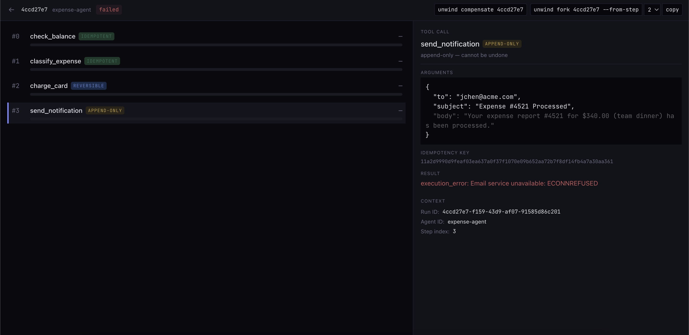

# Unwind

Typed effect classification and automatic compensation for LLM agent tool calls.

When your agent fails at step 6, LangGraph can resume from a checkpoint. Temporal can retry the activity. Neither one refunds the card charge from step 4. Unwind does. You classify each tool call — idempotent, reversible, append-only, destructive — and Unwind handles the rest: idempotency keys, compensation ordering, and a full audit trail of what was undone and what couldn't be.

Middleware, not an execution engine. Composes with LangGraph, Temporal, or raw SDK calls. [Read more here](https://moorching.com/writing/llm-agent-tool-calls-uncompensated-transactions)

<p align="center">
  
</p>

---

## Quickstart

```bash
npm install @unwind/core
```

```ts
import { Unwind } from "@unwind/core";

const unwind = new Unwind({ store: "sqlite", dbPath: "./unwind.db" });

// classify your tools
const checkBalance = unwind.tool({
  name: "check_balance",
  effectClass: "idempotent",
  description: "Check account balance",
  args: { account_id: { type: "string", stable: true } },
  execute: async ({ account_id }) => ({ balance: 50000, currency: "USD" }),
});

const chargeCard = unwind.tool({
  name: "charge_card",
  effectClass: "reversible",
  description: "Charge a card",
  args: {
    amount: { type: "number", stable: true },
    source: { type: "string", stable: true },
  },
  execute: async (args) =>
    stripe.charges.create({ amount: args.amount, source: args.source, idempotency_key: args.__idempotencyKey }),
  compensate: async (_args, result) =>
    stripe.refunds.create({ charge: result.id }),
});

const sendEmail = unwind.tool({
  name: "send_email",
  effectClass: "append-only",
  description: "Send a notification",
  args: {
    to: { type: "string", stable: true },
    subject: { type: "string", stable: true },
  },
  execute: async (args) => email.send(args),
});
```

Run a workflow. When it fails, compensate:

```ts
const runId = unwind.startRun("expense-agent");

await unwind.dispatch(runId, 0, checkBalance, { account_id: "acct_123" });
await unwind.dispatch(runId, 1, chargeCard, { amount: 34000, source: "card_456" });
// step 2 throws — email service is down

const summary = await unwind.compensate(runId);
```

```
Compensation summary:
  Compensated:     charge_card → refunded (re_abc)
  Uncompensatable: (none)
  Failed:          (none)
```

The charge was refunded. The balance check was skipped (idempotent, no side effect). If the email *had* sent before a later step failed, it would appear under Uncompensatable with a human-readable explanation: `send_email to user@acme.com with subject 'Charged' — cannot be recalled`.

---

## Effect Classes

| Class | What it means | On failure |
|---|---|---|
| `idempotent` | No side effect. Safe to retry forever. | Skipped during compensation. |
| `reversible` | Side effect can be undone. Must define `compensate()`. | `compensate()` called automatically. |
| `append-only` | Side effect happened and can't be reversed. | Logged as uncompensatable with detail string. |
| `destructive` | Irreversible and high-impact. Requires approval gate. | Escalated to human operator. |

The effect class drives runtime behavior. Destructive tools won't execute without an approval gate. Reversible tools must provide a `compensate` function at definition time — the type system enforces this.

---

## Framework Integration

Unwind wraps tool calls. It doesn't care what runs your agent.

**Anthropic SDK** — convert tools and dispatch:

```ts
const response = await client.messages.create({
  model: "claude-sonnet-4-20250514",
  tools: unwind.anthropicTools([checkBalance, chargeCard, sendEmail]),
  messages,
});

for (const block of response.content.filter(b => b.type === "tool_use")) {
  const result = await unwind.handleToolUse(runId, step++, block, tools);
  // feed result back into the conversation
}
```

**LangGraph** — plug into the tool layer, let LangGraph handle checkpointing:

```ts
const lgTools = toLangGraphTools(tools, async (tool, args) =>
  unwind.dispatch(runId, step++, tool, args)
);
// pass lgTools to createReactAgent or ToolNode
```

**Temporal** — wrap inside Activities, let Temporal handle durability:

```ts
async function chargeCardActivity(args: ChargeArgs) {
  return unwind.dispatch(runId, stepIndex, chargeCard, args);
  // on workflow failure, call unwind.compensate(runId) in your failure handler
}
```

---

## CLI

```bash
$ unwind inspect abc123 --db ./unwind.db

Run abc123
Agent: expense-agent  Status: compensated

  0  check_balance   [idempotent]   → {balance: 50000}       1ms
  1  charge_card     [reversible]   → {id: "ch_9f2"}         3ms
  2  send_email      [append-only]  ✗ ECONNREFUSED
     ↩ charge_card compensated → {id: "re_4a1"}              2ms
```

Other commands:

```bash
unwind list --db ./unwind.db                        # list all runs
unwind compensate <run-id> --db ./unwind.db         # trigger compensation
unwind fork <run-id> --from-step 2 --db ./unwind.db # fork and replay
unwind summary <run-id> --db ./unwind.db            # compensation summary only
```

---

## Trace Debugger

<p align="center">
  
</p>

```bash
npm run debugger
```

Drop your `unwind.db` into the browser. See every tool call, its effect class, and the compensation outcome. Copy CLI commands to compensate or fork from the UI.

---

## How It Works

Unwind sits between your agent framework and your tool implementations. When a tool call passes through, Unwind checks the declared effect class, generates a deterministic idempotency key from stable arguments, executes the tool, and logs the call and result to an append-only event store. When you call `compensate()`, Unwind walks the completed tool calls in reverse order and applies the strategy each effect class dictates — execute `compensate()` for reversible, log the damage for append-only, escalate for destructive, skip for idempotent.

The event store is SQLite locally, pluggable via the `EventStore` interface. The debugger reads the same file.

---

## What Unwind Is Not

- **Not an execution engine.** Use LangGraph, Temporal, or Inngest for checkpointing and retries.
- **Not an observability tool.** Use LangSmith or Braintrust for LLM tracing.
- **Not a Temporal replacement.** It composes with Temporal.
- **Not an agent framework.** It's middleware for tool calls.

## License

MIT
